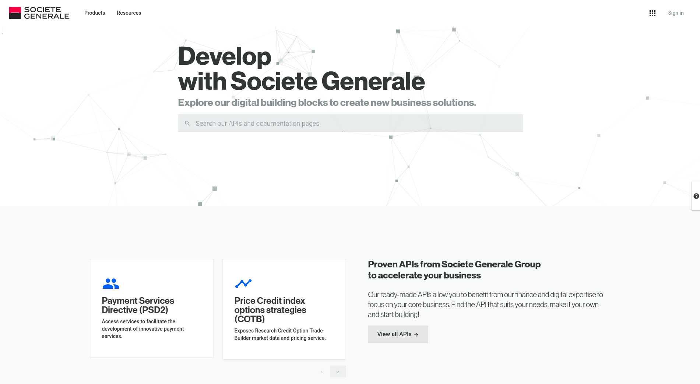

title: Adoptez le "Swagger Driven Testing" pour tester vos APIs simplement
class: animation-fade
layout: true

<!-- This slide will serve as the base layout for all your slides -->
.bottom-bar[
  Swagger Driven Testing - @JBWatenberg - #DevoxxFR
]

---

class: impact

## {{title}}

.right[
[@JBWatenberg](https://twitter.com/JBWatenberg)
]

---

.col-4[
    
]
.col-8[
## Jean-Baptiste WATENBERG

.col-1[
.logo-small[
    <br/><br/><br/>
]
.logo-small[
    
]

.logo-small[
     
]
]
.col-11[
    Développeur @Société Générale<br/><br/><br/><br/>
    [@JBWatenberg](https://twitter.com/JBWatenberg)  <br/><br/>
    [JeanBaptisteWATENBERG](https://github.com/JeanBaptisteWATENBERG)
]
]

---

# SG MARKETS

.alt[
PLATEFORME DE SERVICES B TO B 360°
]


---

class: impact
# + 3500 APIs
____


---

# developer.sgmarkets.com

.col-2[
&nbsp;
]
.col-8[
.full[

]
]
.col-2[
&nbsp;
]

---

class: impact
# Documentation
____

# Qualité

---

# Documentation

## OpenAPI (AKA. SWAGGER)

<br/>
   - Une **spécification**
   - Des **outils**

---

# OpenAPI - Spécification
.condensed-code[
```yaml
/pet:
  post:
    tags:
      - "pet"
    summary: "Add a new pet to the store"
    operationId: "addPet"
    consumes:
      - "application/json"
    produces:
      - "application/json"
    parameters:
      - in: "body"
        description: "Pet object that needs to be added to the store"
        required: true
        schema:
          $ref: "#/definitions/Pet"
    responses:
      201:
        description: "Pet has been successfully added to the store"
    security:
    - petstore_auth: ["write:pets", "read:pets"]
```
]

---

# OpenAPI - Outils

   - Générateurs de code
   - Documentation interactive
   - Ecosystème de composants (validation, aide à la rédaction, etc...) 

---

class: impact
# Comment s'assurer de la qualité de ses APIs ?
---

class: impact, full, middle, center
background-image: url(./images/code.png)
# Les développeurs, avec du code 

---
.col-6[
.full[
    <br/>

]
]
.col-6[
.full[

]
]
---
class: impact, full, middle, center
background-image: url(./images/qa.png)
# Les QA/BA, avec Postman/ Insomnia/SOAP UI 
---
.col-8[
.full[

]
]
--
.col-4[
.full[

]
]
---
class: impact, full, middle, center
background-image: url(./images/user.png)
# Les utilisateurs, avec Swagger UI 
---
.full[

]
---
.col-8[
.full[

]
]
--
.col-4[
.full[

]
]
---
class: impact, full, middle, center
background-image: url(./images/idea.png)
# Swagger Driven Testing 

--

## Demo !
---

class: impact
# Et la suite ?

---

# Continuous Delivery


---

# Open Source


[https://github.com/JeanBaptisteWATENBERG/react-jsonpath-editor](https://github.com/JeanBaptisteWATENBERG/react-jsonpath-editor)

---

class: impact
# Merci !!

.col-4[
.full[
.float-right[

]
]
]
.col-8[
.alt[
Questions ?
]
[@JBWatenberg](https://twitter.com/JBWatenberg) <br/><br/>
[https://bit.ly/2uVC3jr](https://bit.ly/2uVC3jr)<br/><br/>
[https://github.com/JeanBaptisteWATENBERG/](https://github.com/JeanBaptisteWATENBERG/)
]


---

# Credits

Slide 11 : Photo par Markus Spiske sur Unsplash  
Slide 13 : Photo par bonneval sebastien sur Unsplash  
Slide 14 : Gif par Lidl Voyage sur Giphy  
Slide 15 : Photo par Campaign Creators sur Unsplash  
Slide 17 : Gif par Lidl Voyage sur Giphy  
Slide 18 : Photo par Kristopher Roller sur Unsplash  